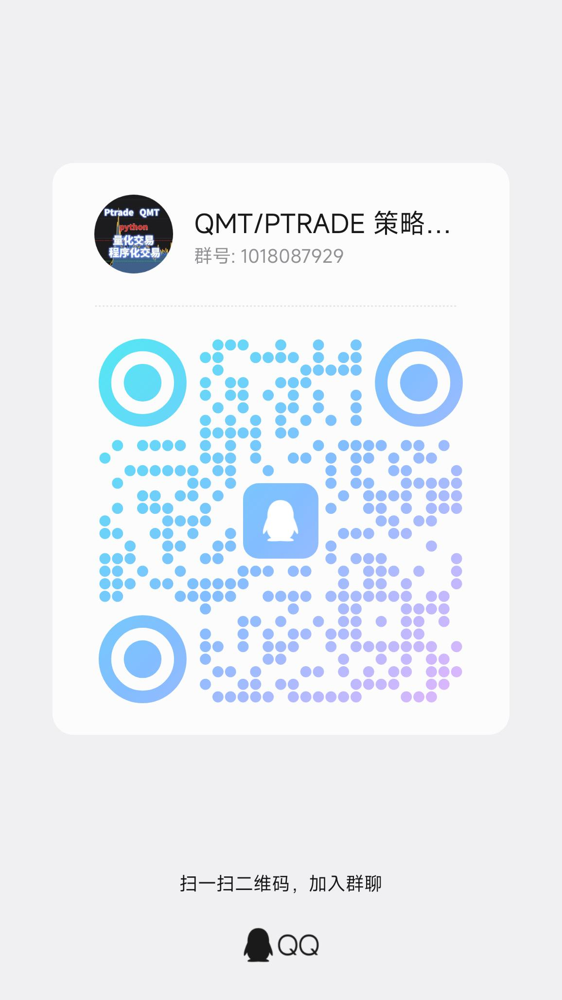

# EasyXT - 模块化QMT量化交易工具集

[](https://www.python.org/)
[](LICENSE)
[](https://www.gtja.com/)
[](https://www.ptqmt.com)

> **注意**：本项目使用的是miniQMT环境。QMT有两个版本：完整版QMT（包含GUI界面）和miniQMT（轻量级API版本）。两者在API使用上基本一致，但在环境配置和部署方式上有显著区别。详细区别请参阅 [📖 QMT版本说明](docs/assets/QMT_VERSIONS.md)。

> 量化为王，策略致胜，我是只聊干货的王者 quant！

---

## 🎯 项目定位

**EasyXT 不是单一框架，而是一套模块化的量化交易工具集**，包含：

### 核心特性

- 🎯 **简化API**: 封装复杂的QMT接口，提供易用的Python API
- 💰 **真实交易**: 支持通过EasyXT接口进行真实股票交易
- 📊 **数据获取**: 集成qstock、akshare等多种数据源
- 📈 **技术指标**: 内置常用技术指标计算
- 🚀 **策略开发**: 提供完整的量化策略开发框架
- 🔐 **自动登录**: 支持QMT/miniQMT自动登录，包括验证码识别
- 📚 **学习实例**: 丰富的教学案例，从入门到高级
- 🌍 **跨平台支持**: 支持Windows、macOS、Linux（通过xqshare远程客户端）

### 模块概览

| 模块 | 类型 | 说明 | 独立性 |
|------|------|------|--------|
| **easy_xt** | 📦 核心库 | QMT API的轻量级封装，提供简洁的数据/交易接口 | ✅ 可独立使用 |
| **easyxt_backtest** | 🔧 扩展工具 | 通用回测框架，支持多策略、多数据源 | ✅ 可独立使用 |
| **101因子平台** | 📊 独立应用 | 基于Streamlit的因子分析Web应用 | ✅ 完全独立 |
| **strategies** | 📁 策略集合 | 完整的交易策略示例（雪球跟单、网格交易等） | ⚠️ 依赖easy_xt |
| **学习实例** | 📚 教学案例 | 从入门到实战的代码教程 | ⚠️ 依赖easy_xt |

**核心理念**：按需选用，低耦合，清晰边界

---

## 🚀 快速导航

### 🤔 我该从哪里开始？

#### 我是新手，想学习量化交易
→ 📖 **[学习路径](#-学习路径)** → 从 `学习实例/` 开始

#### 我只需要API封装，要在自己的项目中使用
→ 📦 **[easy_xt API文档](easy_xt/README.md)** → 只需安装 `easy_xt`

#### 我想做策略回测
→ 🔧 **[回测系统指南](easyxt_backtest/README.md)** → 使用 `easyxt_backtest`

#### 我要用现成的策略
→ 📁 **[策略列表](strategies/README.md)** → 查看 `strategies/` 目录

#### 我想做因子分析
→ 📊 **[101因子平台](101因子/101因子分析平台/README.md)** → 独立Web应用

#### 我想自动登录QMT
→ 🔐 **[QMT自动登录](core/auto_login/README.md)** → 一键启动并登录

### 🔧 遇到问题了？

→ 🆘 **[疑难问题解答 (FAQ)](docs/assets/TROUBLESHOOTING.md)** ← **点击这里！**
- DuckDB数据库找不到？数据下载失败？
- 安装报错？运行失败？性能问题？
- 这里收集了最常见的问题和解决方案！

### 📂 不确定路径配置？

→ 📁 **[路径配置指南](PATH_GUIDE.md)** ← **新手必读！**
- 什么是"项目根目录"？
- 从 GitHub 下载后文件夹是什么名字？
- 如何正确配置路径？

### 🏗️ 我想了解系统架构

→ 📐 **[系统架构文档 (ARCHITECTURE)](ARCHITECTURE.md)** - 了解项目整体设计、模块关系和技术选型

---

## 🌍 跨平台支持

EasyXT 现已支持 **Windows、macOS、Linux** 三大平台！

### 平台支持矩阵

| 平台 | 本地 QMT | 远程 xqshare | 推荐场景 |
|------|----------|--------------|----------|
| **Windows** | ✅ 原生支持 | ✅ 可选 | 专业交易用户 |
| **macOS** | ❌ 不可用 | ✅ 完美支持 | Mac 用户 |
| **Linux** | ❌ 不可用 | ✅ 完美支持 | 服务器部署 |

### Mac/Linux 用户快速开始

通过 **xqshare 远程客户端**，EasyXT 可以在 macOS 和 Linux 上完美运行！

#### 1️⃣ 安装 xqshare

```bash
pip install xqshare
```

#### 2️⃣ 配置环境变量

```bash
# 设置远程服务器地址
export XQSHARE_REMOTE_HOST="your-server-ip"
export XQSHARE_REMOTE_PORT="18812"

# 或者使用 .env 文件
echo "XQSHARE_REMOTE_HOST=your-server-ip" >> .env
echo "XQSHARE_REMOTE_PORT=18812" >> .env
```

#### 3️⃣ 正常使用 EasyXT

```python
from easy_xt import get_api

# 获取 API（自动检测并使用 xqshare）
api = get_api()

# 数据获取和交易完全相同
data = api.data.get_price(['000001.SZ'])
```

### 数据源自动降级

EasyXT 会自动选择最佳数据源：

```
QMT (本地)
    ↓ 失败
xqshare (远程)  ← Mac/Linux 用户自动使用
    ↓ 失败
TDX (通达信)
    ↓ 失败
Eastmoney (东方财富)
```

### 常见问题

**Q: xqshare 是什么？**

A: xqshare 是一个远程客户端代理，让你在没有 Windows QMT 环境的情况下，通过远程服务器使用 QMT 的数据接口。

**Q: 需要自己搭建 xqshare 服务器吗？**

A: 不需要。xqshare 支持连接到已有的远程服务器。你也可以自己搭建服务器（需要 Windows + QMT 环境）。

**Q: 交易功能支持吗？**

A: 是的！通过 xqshare，Mac/Linux 用户也可以进行完整的股票交易操作。

**Q: 性能如何？**

A: xqshare 通过网络连接到远程服务器，性能取决于网络延迟。对于大多数量化策略，延迟是可以接受的。

### 感谢贡献者

特别感谢 **[@jasonhu](https://github.com/jasonhu)** 为项目贡献了 xqshare 跨平台支持功能！

---

## 📦 核心模块说明

### 📁 详细项目结构

```
EasyXT/                          # 项目根目录（从 GitHub 下载后的文件夹名）
├── easy_xt/                    # 核心API模块
│   ├── __init__.py
│   ├── api.py                  # 主API接口
│   ├── data_api.py            # 数据接口
│   ├── trade_api.py           # 交易接口
│   ├── advanced_trade_api.py  # 高级交易接口
│   └── utils.py               # 工具函数
├── easyxt_backtest/           # 回测框架
│   ├── data_manager.py        # 数据管理器
│   ├── engine.py              # 回测引擎
│   ├── performance.py         # 性能分析
│   └── strategies/            # 策略实现
├── 101因子/                    # 因子分析平台
│   └── 101因子分析平台/       # Streamlit应用
├── strategies/                 # 策略集合
│   ├── xueqiu_follow/         # 雪球跟单
│   ├── grid_trading/          # 网格交易
│   ├── jq2qmt/                # 聚宽转QMT
│   └── tdxtrader/             # 通达信预警交易
├── 学习实例/                   # 学习案例
│   ├── 01_基础入门.py
│   ├── 02_交易基础.py
│   └── ...
├── gui_app/                    # GUI应用
│   ├── main_window.py
│   └── widgets/
├── tools/                      # 开发工具
│   ├── debug_qmt_api.py
│   └── demos/
├── config/                     # 配置文件
├── data/                       # 数据存储
├── logs/                       # 日志目录
├── xtquant/                    # QMT相关文件（需手动安装）
├── requirements.txt            # 依赖列表
└── README.md                   # 本文件
```

### 1️⃣ easy_xt - 核心库（可独立使用）

**定位**：轻量级QMT API封装库

**特点**：
- ✅ 简洁的Python接口，隐藏QMT复杂性
- ✅ 统一的数据获取（行情、财务、指数成分股等）
- ✅ 标准化的交易接口（下单、查询、持仓管理）
- ✅ **无依赖其他模块**，可单独集成到任何项目

**安装**：
```bash
pip install -e ./easy_xt
```

**使用示例**：
```python
from easy_xt import get_api

# 获取API实例
api = get_api()

# 获取行情数据
data = api.get_price(
    ['000001.SZ'],
    start='20240101',
    period='1d'
)
```

**📖 详细文档**：[easy_xt/README.md](easy_xt/README.md)

---

### 2️⃣ easyxt_backtest - 回测框架（可独立使用）

**定位**：通用量化策略回测框架

**特点**：
- ✅ 支持多种策略类型（选股策略、因子策略）
- ✅ 多数据源支持（DuckDB、QMT、Tushare）
- ✅ 完整的交易模拟（佣金、滑点、持仓管理）
- ✅ 详细的性能分析（夏普比率、最大回撤等）
- ✅ **不依赖101因子平台**，可独立使用

**安装**：
```bash
# 方法1：添加到 PYTHONPATH（推荐）
# Windows PowerShell:
$env:PYTHONPATH += ";C:\path\to\EasyXT"

# 或永久添加：
[System.Environment]::SetEnvironmentVariable("PYTHONPATH", "C:\path\to\EasyXT", "User")
```

**使用示例**：

```python
from easyxt_backtest import BacktestEngine, DataManager
from easyxt_backtest.strategies import SmallCapStrategy

# 创建数据管理器（无需参数，自动使用QMT/Tushare）
data_manager = DataManager()

# 如果有DuckDB数据库，可以指定路径（可选，提速10倍）
# data_manager = DataManager(duckdb_path='D:/StockData/stock_data.ddb')

# 创建回测引擎
engine = BacktestEngine(initial_cash=1000000, data_manager=data_manager)

# 运行回测
strategy = SmallCapStrategy(select_num=5)
result = engine.run_backtest(strategy, '20230101', '20231231')
result.print_summary()
```

**💡 提示**：
- ✅ **不需要DuckDB** - 无参数即可使用QMT/Tushare数据
- 🚀 **DuckDB是可选的** - 如果有，速度提升10倍

**📖 详细文档**：[easyxt_backtest/README.md](easyxt_backtest/README.md)

---

### 3️⃣ 101因子分析平台（完全独立应用）

**定位**：基于Streamlit的因子研究Web应用

**特点**：
- ✅ 191个Alpha因子（Alpha101全系列 + Alpha191扩展）
- ✅ 可视化工作流编辑器（拖拽式构建策略）
- ✅ 完整的因子分析工具（IC分析、分层回测）
- ✅ **完全独立的Web应用**，不依赖其他模块

**启动**：
```bash
cd 101因子/101因子分析平台
python 启动增强版.py
```

访问：http://127.0.0.1:8510

**📖 详细文档**：[101因子分析平台/README.md](101因子/101因子分析平台/README.md)

---

### 4️⃣ strategies - 策略集合（依赖easy_xt）

**定位**：完整的实战策略示例

**包含策略**：
- ❄️ **雪球跟单**：自动跟随雪球组合调仓
- 🔲 **网格交易**：固定网格、高频分时网格
- 📡 **通达信预警交易**：基于通达信预警自动交易
- 🔄 **聚宽策略转QMT**：JQ2QMT适配器

**依赖关系**：依赖 `easy_xt` 核心库

**📖 详细文档**：[strategies/README.md](strategies/README.md)

---

### 5️⃣ 学习实例 - 教学案例（依赖easy_xt）

**定位**：从入门到实战的代码教程

**学习路径**：
1. **01_基础入门.py** - 数据获取和API使用
2. **02_交易基础.py** - 基础交易操作
3. **04_策略回测.py** - 策略开发与回测
4. **07_akshare数据获取** - 多数据源集成
5. **10_qstock真实案例** - 完整实战案例

**依赖关系**：依赖 `easy_xt` 核心库

---

## 🏗️ 项目架构图

```
EasyXT 项目结构
│
├── 【核心层】可独立使用
│   ├── easy_xt/              # 核心API封装库
│   │   └── 无任何其他依赖
│   │
│   └── easyxt_backtest/      # 回测框架
│       └── 可独立使用（不依赖101因子平台）
│
├── 【应用层】独立应用
│   └── 101因子/101因子分析平台/  # 因子分析Web应用
│       └── 完全独立，不依赖其他模块
│
└── 【示例层】依赖核心库
    ├── strategies/           # 策略集合（依赖easy_xt）
    ├── 学习实例/             # 教学案例（依赖easy_xt）
    └── gui_app/             # GUI界面（依赖easy_xt）
```

**模块依赖关系**：
- `easy_xt` ← 零依赖，可独立使用
- `easyxt_backtest` ← 可独立使用（不依赖101因子）
- `101因子平台` ← 完全独立
- `strategies` → 依赖 `easy_xt`
- `学习实例` → 依赖 `easy_xt`

---

## 📚 学习路径

### 🚀 快速开始（5分钟上手）

#### 基础数据获取

```python
from easy_xt import EasyXT

# 创建API实例
api = EasyXT()

# 初始化数据服务
api.init_data()

# 获取股票价格
data = api.get_price('000001.SZ', count=100)
print(data.head())
```

#### 简单交易示例

```python
# 初始化交易服务
api.init_trade(USERDATA_PATH)
api.add_account(ACCOUNT_ID)

# 买入股票
order_id = api.buy(
    account_id=ACCOUNT_ID,
    code='000001.SZ',
    volume=100,
    price_type='market'
)
```

### 初学者路线

```bash
# 第1步：学习基础API
学习实例/01_基础入门.py
学习实例/02_交易基础.py

# 第2步：了解策略开发
学习实例/04_策略回测.py

# 第3步：运行现成策略
strategies/grid_trading/固定网格.py
```

### 进阶路线

```bash
# 第1步：学习回测框架
easyxt_backtest/examples/small_cap_backtest.py

# 第2步：开发自定义策略
easyxt_backtest/strategies/ (参考策略基类)

# 第3步：使用因子平台
cd 101因子/101因子分析平台
python 启动增强版.py
```

### 实战路线

```bash
# 第1步：部署雪球跟单
strategies/xueqiu_follow/启动雪球跟单.bat

# 第2步：部署通达信预警交易
strategies/tdxtrader/ (查看README)

# 第3步：监控和优化
gui_app/main_window.py
```

---

## ⚙️ 安装指南

> 📖 **安装文档**：
> - **[INSTALL.md](INSTALL.md)** - 快速安装指南
> - **[SETUP_GUIDE.md](SETUP_GUIDE.md)** - 🆕 增强版配置指南（包含详细的 xtquant、数据源、IDE 配置说明）
>
> ⚠️ **遇到 `cannot import name 'datacenter' from 'xtquant'` 错误？** 查看 [SETUP_GUIDE.md - xtquant 配置](SETUP_GUIDE.md#1-xtquant-配置)

### 环境要求

- Python 3.9+
- Windows系统（QMT限制，但 Mac/Linux 可通过 xqshare 使用）
- 已安装QMT客户端（标准版或miniQMT，如需交易功能）

### 快速安装

#### 1️⃣ 安装xtquant（必需且重要）

**⚠️ 重要：本项目需要特殊版本的 xtquant，不能使用 pip 安装的官方版本！**

##### 为什么必须使用特殊版本？

不同券商的QMT版本发布节奏不一致，xtquant接口和行为存在差异。为避免连接失败、字段缺失、接口不兼容等问题，**本项目仅支持以下特定版本**。

##### 下载地址

🔗 **https://github.com/quant-king299/EasyXT/releases/tag/v1.0.0**

下载附件：`xtquant.rar`

##### 安装步骤

**方法 1：直接解压到项目根目录（推荐）**

1. 下载 `xtquant.rar`
2. 解压到项目根目录（即克隆/下载 EasyXT 项目后的文件夹）
3. 确保目录结构为：`项目根目录/xtquant/`

> **说明**：如果你从 GitHub 下载的是 `EasyXT-main.zip`，解压后的文件夹名为 `EasyXT-main`，那么项目根目录就是 `EasyXT-main/`

**方法 2：解压到自定义目录 + 设置环境变量**

1. 解压到自定义目录，如：`C:\xtquant_special`
2. 设置环境变量 `XTQUANT_PATH`：

   **PowerShell**：
   ```powershell
   setx XTQUANT_PATH "C:\xtquant_special"
   ```

   **CMD**：
   ```cmd
   setx XTQUANT_PATH "C:\xtquant_special"
   ```

3. **重启终端/IDE** 使环境变量生效

##### 验证安装

```bash
python -c "from xtquant import datacenter; print('✓ xtquant 安装正确')"
```

如果报错 `cannot import name 'datacenter' from 'xtquant'`，说明 xtquant **未安装或版本不完整**。

##### 一键下载并解压（PowerShell）

```powershell
$url = "https://github.com/quant-king299/EasyXT/releases/download/v1.0.0/xtquant.rar"
$dest = "$PWD\xtquant.rar"
Invoke-WebRequest -Uri $url -OutFile $dest -UseBasicParsing
if (Test-Path "$env:ProgramFiles\7-Zip\7z.exe") {
  & "$env:ProgramFiles\7-Zip\7z.exe" x -y "$dest" -o"$PWD"
} elseif (Get-Command 7z.exe -ErrorAction SilentlyContinue) {
  7z x -y "$dest" -o"$PWD"
} else {
  Write-Host "未检测到 7-Zip，请手动解压 $dest 到项目根目录"
}
Remove-Item $dest -ErrorAction SilentlyContinue
if (Test-Path "$PWD\xtquant") { Write-Host "✓ xtquant 安装完成" } else { Write-Host "✗ xtquant 目录未找到，请检查解压" }
```

#### 2️⃣ 安装核心库

```bash
# 安装easy_xt核心库
pip install -e ./easy_xt

# 验证安装
python -c "from easy_xt import get_api; print('✓ 安装成功')"
```

#### 3️⃣ 按需使用扩展模块

```bash
# 如果需要回测功能，将项目路径添加到 PYTHONPATH
# PowerShell:
$env:PYTHONPATH += ";C:\Users\Administrator\EasyXT"

# 或永久添加：
[System.Environment]::SetEnvironmentVariable("PYTHONPATH", "C:\Users\Administrator\EasyXT", "User")

# 如果需要因子平台
cd 101因子/101因子分析平台
pip install -r requirements.txt

# 如果需要自动登录功能（🆕）
pip install pywinauto pyautogui
```

#### 4️⃣ 配置自动登录（可选）

如果需要使用 QMT 自动登录功能：

1. 复制配置文件：
   ```bash
   cp .env.example .env
   ```

2. 编辑 `.env` 文件，填写QMT登录信息：
   ```env
   QMT_EXE_PATH=D:\国金QMT交易端模拟\bin.x64\XtMiniQmt.exe
   QMT_USER_ID=8888499999
   QMT_PASSWORD=your_password
   QMT_DATA_DIR=D:\国金QMT交易端模拟\userdata_mini
   ```

3. 运行自动登录：
   ```bash
   python start_qmt.py
   ```

详细说明：[🔐 QMT自动登录指南](core/auto_login/README.md)

---

### ⚙️ 首次使用配置（重要）

#### 配置 Tushare Token（如果需要使用数据下载功能）

如果你需要使用 **Tushare 数据下载功能**，必须配置Token。

##### 步骤 1：获取 Tushare Token

1. 访问 [Tushare Pro](https://tushare.pro) 注册账号
2. 登录后进入「用户中心」→「接口Token」
3. 复制你的 Token（类似：`xxxxxxxxxxxxxxxxxxxxxxxxxxxxxxxxxxxxxxxx`）

##### 步骤 2：配置环境变量文件

**方法 A：使用 .env 文件（推荐）**

1. 复制配置文件模板：
   ```bash
   # Windows PowerShell
   Copy-Item .env.example .env

   # Windows CMD
   copy .env.example .env

   # Linux/Mac
   cp .env.example .env
   ```

2. 编辑 `.env` 文件，填写你的 Token：
   ```env
   TUSHARE_TOKEN=你的Token（替换这一行）
   ```

3. 保存文件

**方法 B：直接设置环境变量**

```powershell
# PowerShell
setx TUSHARE_TOKEN "你的Token"

# CMD
setx TUSHARE_TOKEN "你的Token"
```

**方法 C：在代码中设置（不推荐，仅用于测试）**

```python
import os
os.environ['TUSHARE_TOKEN'] = '你的Token'
```

##### 步骤 3：验证配置

```bash
python -c "import os; from dotenv import load_dotenv; load_dotenv(); print('✓ Token:', os.getenv('TUSHARE_TOKEN')[:10] + '...')"
```

##### 常见问题

**Q: 不配置 Token 会影响哪些功能？**
A: 以下功能会受影响：
- ❌ 无法使用 Tushare 数据源（回测时自动降级到其他数据源）
- ❌ 无法下载股票列表、财务数据等
- ✅ QMT本地数据仍可正常使用
- ✅ 其他不依赖Tushare的功能不受影响

**Q: Token 会被泄露吗？**
A: `.env` 文件已被加入 `.gitignore`，不会提交到Git。请勿手动提交包含Token的文件。

**Q: 如何获取 Token？需要付费吗？**
A: Tushare Pro采用积分制：
- 注册后会获得一些初始积分，可兑换基础权限的Token
- 基础功能（如股票行情、基础数据）所需积分较少
- 高级功能（如财务数据、高频数据）需要更多积分，可能需要充值
- 详细积分规则：https://tushare.pro/document/2
- 建议先试用基础功能，确认满足需求后再考虑充值

**Q: 不想用Tushare，有其他选择吗？**
A: 本项目支持多种数据源，可按需选择：
- **QMT本地数据**：如果有QMT终端，可直接使用本地历史数据
- **DuckDB本地数据库**：通过Tushare或QMT下载数据到本地，回测速度最快
- **akshare**：免费数据接口（功能类似Tushare）
- **qstock**：免费数据接口

配置优先级：DuckDB > QMT > Tushare > akshare > qstock

**Q: 如何下载DuckDB数据库？**
A: 两种方式（详见 [DuckDB使用指南](docs/assets/DUCKDB_GUIDE.md)）：

1. **GUI方式（推荐）**：运行 `python run_gui.py`，在"Tushare下载"标签页中勾选"日线行情"和"市值数据"，点击下载。只需Tushare Token，无需QMT。
2. **命令行方式**：运行 `python tools/setup_duckdb.py`，按提示选择下载模式。

---

### 📋 安装检查清单

在开始使用前，请确认以下事项：

- [ ] 已下载并解压特殊版本的 `xtquant`
- [ ] 验证 `from xtquant import datacenter` 不报错
- [ ] 已安装 `easy_xt` 核心库（`pip install -e ./easy_xt`）
- [ ] 如需回测，已设置 PYTHONPATH 指向项目目录
- [ ] 如需Tushare数据，已配置 Token
- [ ] QMT客户端已安装并登录
- [ ] Python 版本 ≥ 3.9

### 快速验证安装

运行以下命令验证所有组件：

```bash
# 1. 验证 xtquant（如果报错，查看 SETUP_GUIDE.md）
python -c "from xtquant import datacenter; print('✓ xtquant OK')"

# 2. 验证 easy_xt
python -c "from easy_xt import get_api; print('✓ easy_xt OK')"

# 3. 验证 easyxt_backtest（如果已安装）
python -c "import easyxt_backtest; print('✓ easyxt_backtest OK')"

# 4. 验证 Tushare Token（如果已配置）
python -c "from dotenv import load_dotenv; load_dotenv(); import os; print('✓ Tushare Token:', os.getenv('TUSHARE_TOKEN')[:10] + '...') if os.getenv('TUSHARE_TOKEN') else print('✗ Token未配置')"
```

**如果第 1 步报错**（`cannot import name 'datacenter' from 'xtquant'`），请查看 **[SETUP_GUIDE.md - xtquant 配置](SETUP_GUIDE.md#1-xtquant-配置)** 获取详细解决方案。

---

## 🛠️ 开发者工具（可选）

项目包含一些开发者工具和演示脚本，位于 `tools/` 目录：

### 诊断工具
- `tools/debug_qmt_api.py` - 检查 easy_xt API 结构
- `tools/debug_data_api.py` - 验证数据连接

### 演示脚本
- 配置系统演示
- 监控告警演示
- 任务调度器演示
- 性能压测演示
- 日志管理演示

### 监控系统
```bash
# 启动监控服务
python start_monitor.py --config config/monitor_config.json

# 查看状态
python start_monitor.py --status
```

### 雪球跟单策略

**快速启动**：
```powershell
# 批处理脚本（Windows）
.\strategies\xueqiu_follow\启动雪球跟单.bat

# 或 Python 入口
python strategies\xueqiu_follow\start_xueqiu_follow_easyxt.py
```

**常见问题**：
- **Q**: 连接返回 -1 / "交易服务连接失败"？
- **A**: 99% 为 `qmt_path` 路径错误，请确保指向本机 `userdata` 或 `userdata_mini` 目录，避免 `0MT` 与 `userdata mini` 等拼写错误。

**详细配置**: 查看 `strategies/xueqiu_follow/README.md`

### JQ2QMT / QKA 服务（聚宽策略迁移）

如需将聚宽策略迁移到QMT：
```powershell
python strategies\jq2qmt\run_qka_server.py --account YOUR_ACCOUNT_ID --mini-qmt-path "C:\\Path\\To\\miniQMT"
```

详细文档：查看 `strategies/jq2qmt/README.md`

---

详细文档：查看 `tools/` 目录下的 README 文件

---

## 🎓 常见问题

> 💡 **遇到更复杂的问题？** 查看 **[🔧 疑难问题解答 (FAQ)](docs/assets/TROUBLESHOOTING.md)** 获取详细的故障排查指南！

### Q1: 我应该安装哪些模块？

**A**: 根据需求选择：
- **只要API** → 只安装 `easy_xt`
- **要做回测** → 安装 `easy_xt` + `easyxt_backtest`
- **因子研究** → 只使用 `101因子平台`（完全独立）
- **学习量化** → 安装 `easy_xt` + 看 `学习实例/`
- **使用现成策略** → 安装 `easy_xt` + 看 `strategies/`

### Q2: 这些模块之间有什么依赖关系？

**A**:
- `easy_xt`：无依赖，可独立
- `easyxt_backtest`：可独立，不依赖101因子平台
- `101因子平台`：完全独立
- `strategies`、`学习实例`：依赖 `easy_xt`

### Q3: 我可以在自己的项目中只使用easy_xt吗？

**A**: **完全可以！** `easy_xt` 就是设计成可独立使用的库：

```python
# 在你的项目中
from easy_xt import get_api

api = get_api()
data = api.get_price(['000001.SZ'], start='20240101', period='1d')
```

### Q4: 101因子平台必须配合easy_xt使用吗？

**A**: **不需要**。101因子平台是完全独立的Web应用，可以单独使用。

### Q5: 我是新手，应该从哪里开始？

**A**: 建议路径：
1. 阅读 `学习实例/01_基础入门.py`
2. 运行 `学习实例/02_交易基础.py`
3. 尝试 `学习实例/04_策略回测.py`
4. 需要时再学习其他模块

---

## 📊 与其他项目的对比

| 项目 | 定位 | 关系 |
|------|------|------|
| **miniQMT** | QMT官方Python接口 | EasyXT依赖的基础 |
| **EasyXT** | miniQMT的简化封装 | 本项目的核心库 |
| **QMT官方** | 迅投QMT交易平台 | 底层交易软件 |
| **聚宽JoinQuant** | 在线量化平台 | 通过JQ2QMT可集成 |
| **Backtrader** | 通用回测框架 | `easyxt_backtest`是QMT专用版 |

---

## 🤝 贡献指南

欢迎提交Issue和Pull Request！

### 开发流程

1. Fork 项目
2. 创建特性分支 (`git checkout -b feature/AmazingFeature`)
3. 提交更改 (`git commit -m 'Add some AmazingFeature'`)
4. 推送到分支 (`git push origin feature/AmazingFeature`)
5. 开启 Pull Request

### 代码规范

- 使用 Python PEP 8 编码规范
- 添加详细的文档字符串
- 编写单元测试

---

## 📈 更新日志

### v1.0.0 (2025-01-11)
- ✅ 初始版本发布
- ✅ 完整的EasyXT API封装
- ✅ 丰富的学习实例
- ✅ 修复交易服务初始化问题

---

## 🔗 相关链接

- **项目主页**: https://github.com/quant-king299/EasyXT
- **问题反馈**: https://github.com/quant-king299/EasyXT/issues
- **网站**: https://www.ptqmt.com
- **微信公众号**: 王者quant

---

## 📄 许可证

MIT License - 详见 [LICENSE](LICENSE) 文件

---

## ⚠️ 风险提示

1. **投资风险**：量化交易存在投资风险，请谨慎操作
2. **测试环境**：建议先在模拟环境中测试策略
3. **资金管理**：合理控制仓位，设置止损止盈
4. **合规要求**：遵守相关法律法规和交易所规则

---

## 🙏 致谢

### 核心依赖

- [迅投QMT](https://www.gtja.com/) - 提供量化交易平台
- [qstock](https://github.com/tkfy920/qstock) - 股票数据获取
- [akshare](https://github.com/akfamily/akshare) - 金融数据接口

### 贡献者

特别感谢以下贡献者为项目做出的贡献：

- **[@jasonhu](https://github.com/jasonhu)** - 添加 xqshare 跨平台支持，使 EasyXT 可以在 macOS 和 Linux 上运行（[PR #19](https://github.com/quant-king299/EasyXT/pull/19)）

> 💬 **欢迎贡献！** 如果你也想为项目做出贡献，欢迎提交 Issue 或 Pull Request。查看[贡献指南](#-贡献指南)了解更多详情。

---

**免责声明**: 本项目仅供学习和研究使用，不构成投资建议。使用本项目进行实际交易的风险由用户自行承担。

---

## 关注公众号 / 加群交流

- 关注公众号：


- 欢迎加入QQ交流群：492287081（或扫码加入）



- 欢迎加入知识星球，获取更多量化交易干货和一对一答疑服务


