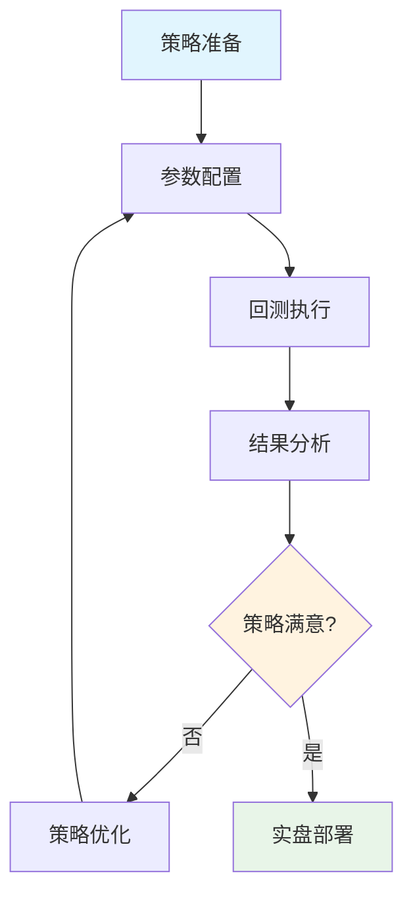

# 04_策略回测教程

## 📚 课程概述
**项目地址**: https://github.com/quant-king299/EasyXT
本教程基于 `学习实例/04_策略回测.py` 文件，详细介绍EasyXT回测系统的使用方法和策略开发流程。


本教程专注于量化策略回测系统的学习和使用，展示从策略回测到实盘部署的完整流程。通过本课程，您将掌握专业的量化回测方法和工具，为实盘策略开发打下坚实基础。

### 🎯 学习目标
- 掌握专业回测工具的使用方法
- 理解关键回测指标的含义和分析
- 熟悉完整的回测操作流程
- 了解从回测到实盘的部署路径

### 📋 课程大纲
1. **回测系统界面介绍** - 了解专业回测工具
2. **回测结果分析** - 解读关键指标
3. **净值曲线分析** - 理解可视化展示
4. **回测操作流程** - 掌握完整步骤
5. **从回测到实盘** - 实盘部署要素

---

## 🛠️ 环境准备

### 系统要求
- Windows 10/11 操作系统
- Python 3.7+ 环境

### QMT账号获取指导

**📱 还没有QMT账号的朋友，可以扫码加我微信，全程指导搞定QMT账号！**


- 迅投QMT客户端（已安装、启动并登录）

### 配置信息
```python
# 配置信息（请根据实际情况修改）
USERDATA_PATH = r'D:\国金QMT交易端模拟\userdata_mini'  # 修改为实际路径
ACCOUNT_ID = "39020958"  # 修改为实际账号
TEST_CODES = ["000001.SZ", "000002.SZ", "600000.SH"]  # 测试用股票
```

### 项目结构
```
miniqmt扩展/
├── easy_xt/           # EasyXT核心库
├── xtquant/           # xtquant原始库
├── 学习实例/          # 学习示例代码
│   └── 04_策略回测.py # 本教程对应的实例代码
├── gui_app/           # GUI应用程序
│   └── backtest/      # 回测组件
├── strategies/        # 策略文件夹
├── config/            # 配置文件
├── data/              # 数据文件
├── logs/              # 日志文件
└── notebooks/         # Jupyter笔记本
```

---

## 第1课：回测系统界面介绍

### 🖼️ EasyXT回测系统界面详解

#### 📊 左侧参数配置区
```
┌─ 回测参数设置 ─────────────────────┐
│ 股票代码: 000001.SZ (平安银行)      │
│ 开始日期: 2024/9/21 星期六          │
│ 结束日期: 2025/9/21 星期日          │
│ 初始资金: 1000000.00 元            │
│ 手续费率: 0.0001%                  │
│ ✅ QMT连接 (自动连接)              │
└────────────────────────────────────┘
```

#### 📈 策略参数配置
```
┌─ 双均线策略 ───────────────────────┐
│ 短期均线: 5  (日均线)              │
│ 长期均线: 20 (日均线)              │
│ RSI周期:  14 (日)                  │
└────────────────────────────────────┘
```

#### ⚙️ 高级选项
- ☑️ 启用参数优化
- ☑️ 基准比较
- ☑️ 详细回测分析

#### 🎛️ 操作按钮
- 🟢 开始回测
- 📊 导出回测
- 📋 导出HTML报告

#### 📊 右侧结果展示区
```
┌─ 回测结果分析 ─────────────────────┐
│                                    │
│  💚 总收益率     💙 年化收益率      │
│    4.7713%        5.1476%         │
│                                    │
│  🟡 夏普比率     🔴 最大回撤       │
│    0.253          7.1999%         │
│                                    │
└────────────────────────────────────┘
```

#### 📈 投资组合净值曲线
- **蓝色实线**：策略净值曲线 (从0.95上升至1.10)
- **红色虚线**：基准线 (1.0基准)
- **时间轴**：09-08 至 07-31
- **特征**：前期调整，后期显著上涨

---

## 第2课：回测结果分析

### 📊 核心回测指标解析

#### 💚 总收益率：4.7713%
- **含义**：策略在回测期间的总收益
- **计算**：(期末净值 - 期初净值) / 期初净值
- **评价**：正收益表明策略有效性
- **实际表现**：在一年期间获得4.77%的正收益

#### 💙 年化收益率：5.1476%
- **含义**：策略年化后的收益水平
- **计算**：考虑复利效应的年化收益
- **评价**：与无风险收益率(约3%)对比，有一定优势
- **实际表现**：年化收益超过银行定期存款

#### 🟡 夏普比率：0.253
- **含义**：单位风险下的超额收益
- **计算**：(策略收益 - 无风险收益) / 策略波动率
- **评价**：>1为优秀，>0.5为良好，0.253为一般
- **改进方向**：可通过降低波动率或提高收益来优化

#### 🔴 最大回撤：7.1999%
- **含义**：策略净值的最大跌幅
- **计算**：从峰值到谷值的最大跌幅
- **评价**：<10%为良好，7.2%属于可接受范围
- **风险控制**：需要关注回撤控制机制

### 📈 指标评估标准

| 指标 | 优秀 | 良好 | 一般 | 较差 |
|------|------|------|------|------|
| 年化收益率 | >15% | 8-15% | 3-8% | <3% |
| 夏普比率 | >1.0 | 0.5-1.0 | 0.2-0.5 | <0.2 |
| 最大回撤 | <5% | 5-10% | 10-20% | >20% |

---

## 第3课：净值曲线分析

### 📈 投资组合净值曲线分析

#### 🔵 蓝色实线 - 策略净值曲线
- 显示策略净值的历史走势
- 反映策略的收益波动特征
- 可观察策略的稳定性和风险

#### 🔴 红色虚线 - 基准线
- 通常为1.0基准线或市场指数
- 用于对比策略相对表现
- 评估策略的超额收益能力

#### 📊 曲线特征分析
- **时间范围**：09-08至07-31期间表现
- **前期阶段**：策略经历调整期（0.95-1.0区间）
- **中期阶段**：策略表现平稳（小幅波动）
- **后期阶段**：策略显著上涨（突破1.05）
- **整体趋势**：呈现上升趋势，符合预期
- **波动特征**：存在一定回撤，但整体向上

### 📊 净值曲线分析要点

```python
# 净值曲线关键观察点
观察要点 = {
    "趋势性": "整体上升/下降/震荡",
    "稳定性": "波动幅度和频率",
    "回撤控制": "最大回撤深度和持续时间",
    "收益一致性": "不同时期的表现差异",
    "基准对比": "相对基准的超额收益"
}
```

---

## 第4课：回测操作流程

### 🔧 标准回测操作流程

#### 1️⃣ 策略准备阶段
- 确定策略逻辑和参数
- 选择回测标的和时间范围
- 设置初始资金和交易成本
- 准备策略代码和配置文件

#### 2️⃣ 参数配置阶段
- 输入股票代码（支持模糊搜索）
- 设置回测时间区间（建议1-3年）
- 配置策略参数（均线周期、RSI等）
- 选择高级选项（参数优化、基准对比）

#### 3️⃣ 回测执行阶段
- 点击'开始回测'按钮
- 系统自动下载历史数据
- 执行策略逻辑计算
- 生成回测结果和图表

#### 4️⃣ 结果分析阶段
- 查看核心指标（收益率、夏普比率、回撤）
- 分析净值曲线走势
- 导出详细HTML报告
- 评估策略可行性

#### 5️⃣ 策略优化阶段
- 根据回测结果调整参数
- 进行参数敏感性分析
- 多周期验证策略稳定性
- 准备实盘部署

### 🔄 回测流程图



---

## 第5课：从回测到实盘

### 🚀 实盘部署关键步骤

#### 📋 实盘前检查清单
- ✅ 回测结果稳定且符合预期
- ✅ 多周期验证策略有效性
- ✅ 风险控制机制完善
- ✅ 交易执行逻辑正确
- ✅ 异常处理机制健全

#### 🔧 技术准备要素
- **实时数据接口**：稳定连接
- **交易接口权限**：权限和配置
- **监控和报警系统**：实时监控
- **日志记录和分析**：完整记录
- **资金管理和风控**：风险控制

#### ⚠️ 风险控制要点
- 设置合理的止损止盈
- 控制单笔交易仓位
- 监控策略运行状态
- 建立应急处理机制
- 定期评估策略表现

### 🔗 回测与实盘的关系

```python
# 回测到实盘的转换要点
转换要点 = {
    "数据源": "历史数据 → 实时数据",
    "执行方式": "模拟交易 → 真实交易",
    "风险控制": "理论验证 → 实际风控",
    "监控方式": "事后分析 → 实时监控",
    "资金管理": "虚拟资金 → 真实资金"
}
```

---

## 💡 学习要点总结

### ✅ 核心掌握内容
1. **回测系统界面和功能**
2. **关键回测指标的含义**
3. **净值曲线的分析方法**
4. **完整的回测操作流程**
5. **从回测到实盘的路径**
6. **实盘部署的关键要素**

### 🚀 下一步学习建议
- 完成回测系统学习后
- 继续学习 `05_实盘策略开发.py`
- 学习完整的实盘策略开发流程
- 掌握高级多因子策略的详细实现

### 📚 相关资源

#### 🚀 回测框架启动方法
```bash
# 方法1：模块方式启动（推荐）
python -m gui_app.backtest.backtest_widget

# 方法2：直接运行文件
python gui_app/backtest/backtest_widget.py

# 方法3：从项目根目录启动
cd miniqmt扩展
python -m gui_app.backtest.backtest_widget

# 方法4：使用完整路径
python C:\Users\Administrator\Desktop\miniqmt扩展\gui_app\backtest\backtest_widget.py
```

#### 📂 回测组件文件路径
```
miniqmt扩展/
└── gui_app/
    └── backtest/
        ├── backtest_widget.py      # 主回测界面
        ├── __init__.py            # 包初始化文件
        ├── strategy_manager.py    # 策略管理器
        ├── data_manager.py        # 数据管理器
        └── result_analyzer.py     # 结果分析器
```

#### 🔗 学习资源链接
- **实盘策略学习**：`学习实例/05_实盘策略开发.py`
- **基础交易学习**：`学习实例/03_高级交易.py`
- **回测系统源码**：`gui_app/backtest/`

---

## 🎓 课程总结

通过本课程的学习，您已经掌握了专业回测系统的使用方法，理解了关键指标的含义，熟悉了完整的回测流程。这为您进行实盘策略开发打下了坚实的基础。

**记住**：回测是策略验证的第一步，但不是最后一步。真正的考验在实盘交易中，需要持续监控、优化和风险控制。

🎯 **建议**：先充分理解回测，再进行实盘策略开发，这样才能构建出稳健可靠的量化交易系统。

---

## ❓ 常见问题

### Q1: 回测结果与实盘差异很大怎么办？
**A**: 这是常见现象，主要原因包括：
- **滑点影响**：实盘交易存在买卖价差
- **流动性问题**：大单可能无法按理想价格成交
- **交易成本**：手续费、印花税等成本
- **数据质量**：回测数据可能存在偏差

**解决方案**：
- 在回测中设置更真实的交易成本
- 考虑滑点和流动性限制
- 使用高质量的历史数据
- 进行纸上交易验证

### Q2: 如何选择合适的回测时间周期？
**A**: 建议遵循以下原则：
- **最短周期**：至少1年，包含完整的市场周期
- **推荐周期**：2-3年，覆盖牛熊市场
- **数据充足性**：确保有足够的交易样本
- **市场代表性**：包含不同市场环境

### Q3: 夏普比率多少算好？
**A**: 夏普比率评估标准：
- **>2.0**：非常优秀
- **1.0-2.0**：优秀
- **0.5-1.0**：良好
- **0.2-0.5**：一般
- **<0.2**：较差

### Q4: 最大回撤控制在多少比较合适？
**A**: 回撤控制建议：
- **保守型策略**：<5%
- **稳健型策略**：5-10%
- **积极型策略**：10-15%
- **高风险策略**：15-20%
- **超过20%**：需要重新评估策略

### Q5: 回测时如何避免过度拟合？
**A**: 防止过度拟合的方法：
- **样本外测试**：保留部分数据用于验证
- **交叉验证**：使用不同时间段验证
- **参数稳定性**：测试参数敏感性
- **简化策略**：避免过于复杂的规则
- **多市场验证**：在不同市场环境下测试

### Q6: 如何处理回测中的数据缺失？
**A**: 数据处理策略：
- **前向填充**：使用前一个有效值
- **线性插值**：适用于连续数据
- **跳过处理**：忽略缺失数据点
- **数据源切换**：使用备用数据源
- **标记处理**：记录数据质量问题

### Q7: 回测组件启动失败怎么办？
**A**: 故障排除步骤：

#### 🔧 1. 检查依赖库
```bash
pip install backtrader matplotlib pandas numpy
pip install PyQt5 或 pip install PySide2
```

#### 📂 2. 确认文件路径
```bash
# 检查回测组件是否存在
dir gui_app\backtest\backtest_widget.py

# 或者使用ls命令（Git Bash）
ls gui_app/backtest/backtest_widget.py
```

#### 🚀 3. 多种启动方式尝试
```bash
# 方式1：模块启动（推荐）
python -m gui_app.backtest.backtest_widget

# 方式2：直接运行
python gui_app\backtest\backtest_widget.py

# 方式3：完整路径
python C:\Users\Administrator\Desktop\miniqmt扩展\gui_app\backtest\backtest_widget.py

# 方式4：切换到项目目录后启动
cd /d C:\Users\Administrator\Desktop\miniqmt扩展
python -m gui_app.backtest.backtest_widget
```

#### 🔌 4. 检查QMT连接
```python
# 确保QMT客户端已启动并登录
# 检查连接状态
from xtquant import xtdata
print(xtdata.get_market_data(['000001.SZ'], period='1d', count=1))
```

#### 📋 5. 查看错误日志
```bash
# 检查项目日志
type logs\backtest.log
type logs\error.log

# 或者查看Python错误输出
python -m gui_app.backtest.backtest_widget 2>&1 | tee error_log.txt
```

#### ⚠️ 6. 常见错误解决
- **ModuleNotFoundError**: 检查Python路径和包安装
- **ImportError**: 安装缺失的依赖库
- **FileNotFoundError**: 确认文件路径正确
- **Permission Error**: 以管理员权限运行

### Q8: 如何优化策略参数？
**A**: 参数优化方法：
- **网格搜索**：遍历参数组合
- **随机搜索**：随机采样参数空间
- **贝叶斯优化**：智能参数搜索
- **遗传算法**：进化式参数优化
- **步进优化**：逐步调整参数

### Q9: 回测数据源选择建议？
**A**: 数据源优先级：
1. **EasyXT API**：官方数据，质量最高
2. **xtquant**：迅投官方，稳定可靠
3. **qstock**：轻量级，适合快速测试
4. **akshare**：开源方案，数据丰富
5. **本地数据**：离线使用，需要定期更新

### Q10: 如何评估策略的实盘适用性？
**A**: 评估检查清单：
- ✅ **收益稳定性**：多周期表现一致
- ✅ **风险可控性**：回撤在可接受范围
- ✅ **交易频率**：适合实际操作
- ✅ **资金容量**：策略容量匹配资金规模
- ✅ **技术可行性**：实盘执行技术可行
- ✅ **成本考虑**：交易成本不会侵蚀收益