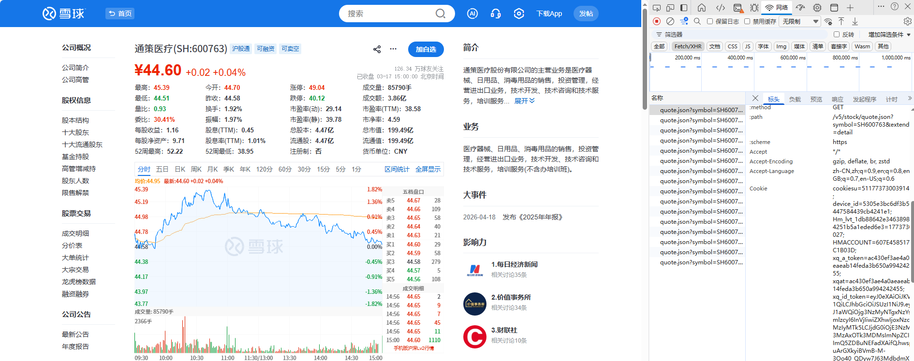

# 雪球Cookie快速配置

快速配置雪球Cookie，30秒完成设置。

---

## ⚡ 30秒快速获取Cookie

### 步骤（图文版）

#### 1️⃣ 登录雪球
访问：https://xueqiu.com 并登录

#### 2️⃣ 打开任意股票页面
例如：https://xueqiu.com/S/SH600763

#### 3️⃣ 打开开发者工具并查看网络请求
- 按 `F12` 键打开开发者工具
- 点击 `Network` (网络) 标签
- 刷新页面 (F5)
- 点击任意请求（如 `/SH600763`）
- 在右侧 `Headers` (请求头) 中找到 `Cookie:` 字段
- 复制整个 Cookie 字段的值



#### 4️⃣ 配置到系统
编辑配置文件：
```
C:\Users\Administrator\Desktop\miniqmt扩展\strategies\xueqiu_follow\config\unified_config.json
```

找到第199行左右的 `xueqiu_settings.cookie` 字段，替换为：

```json
"xueqiu_settings": {
  "cookie": "xq_a_token=你复制的值; xq_is_login=1; u=你的用户ID"
}
```

#### 5️⃣ 重启系统
双击 `启动雪球跟单-简化的.bat`

---

## ✅ 验证Cookie是否有效

启动系统后查看日志：

**成功**：
```
[INFO] Cookie验证通过
[INFO] 获取组合持仓成功
```

**失败**：
```
[ERROR] Cookie已过期
[ERROR] Cookie验证失败
```

---

## 🔧 常见问题速查

| 问题 | 解决方案 |
|------|---------|
| 找不到配置文件 | 路径是：`strategies\xueqiu_follow\config\unified_config.json` |
| Cookie格式错误 | 检查是否有分号和空格：`; ` |
| Cookie过期 | 重新登录雪球并获取新Cookie |
| 缺少xq_a_token | 必须包含此Cookie |
| 提示未登录 | 检查是否包含 `xq_is_login=1` |

---


## 🔄 更新Cookie

**更新时机**：
- 系统提示Cookie过期时
- 建议每隔1-2周更新一次

**更新步骤**：
1. 重新登录雪球网站
2. 获取新Cookie（同上）
3. 更新配置文件
4. 重启系统

---

## 💡 提示

- Cookie只用于读取公开数据，不会进行交易
- 配置文件只在本地，安全可靠
- Cookie有效期约30天，会自动续期

---

**需要帮助？** 查看完整教程：[获取雪球Cookie教程.md](./获取雪球Cookie教程.md)
